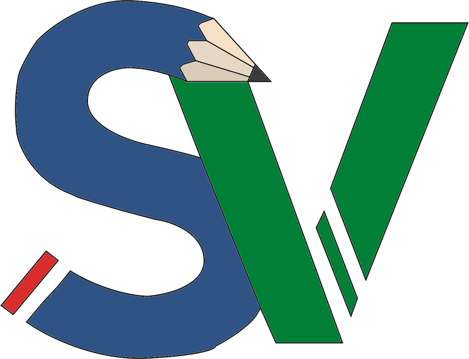

<h1 align="center"> Se Vira </h1>
<h2 align="center">Aplicação cujo objetivo é ajudar na preparação para vestibular</h2>

## 🎯 Objetivo

 Repositório principal do projeto Se Vira, esse que é o P.I. do 1º Semestre do curso de Desenvolvimento de Software Multiplaforma da FATEC Franca. 

## 💻 Projeto

Este projeto consiste em uma aplicação web com o intuito de auxiliar os jovens na preparação para vestibular, oferecendo dicas, exercícios e simulados de provas antigas

 

## Tecnologia

Aplicativo criado utilizando

 
 - HTML 
 - CSS 
 - JavaScript 
 - PHP

## Funcionalidades

A aplicação é um sistema web simples com autenticação do usuário.

Na tela inicial, é possível ver algumas dicas de como estudar para cada matéria.

Ainda na tela inicial é disponibilizado as provas antigas do ENEM para serem feitas como simulado.

Disponibilização de exercícios e correção das questões dos simulados.

## Desenvolvido

Todo o projeto foi desenvolvido pelo aluno:  

Guilherme de Carvalho Ferreira.
 
